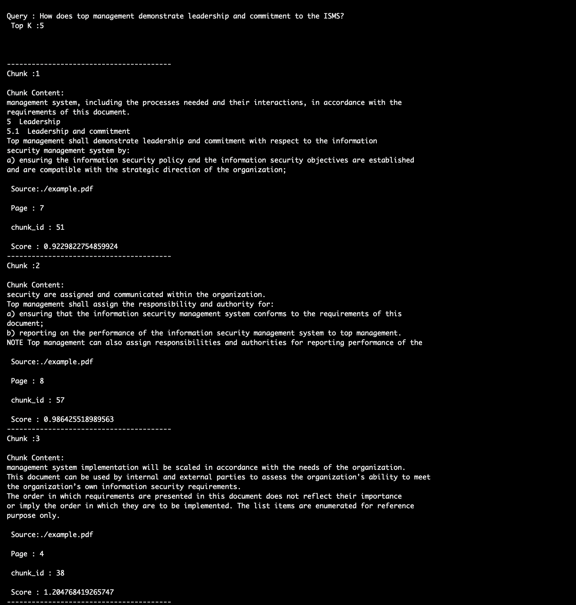
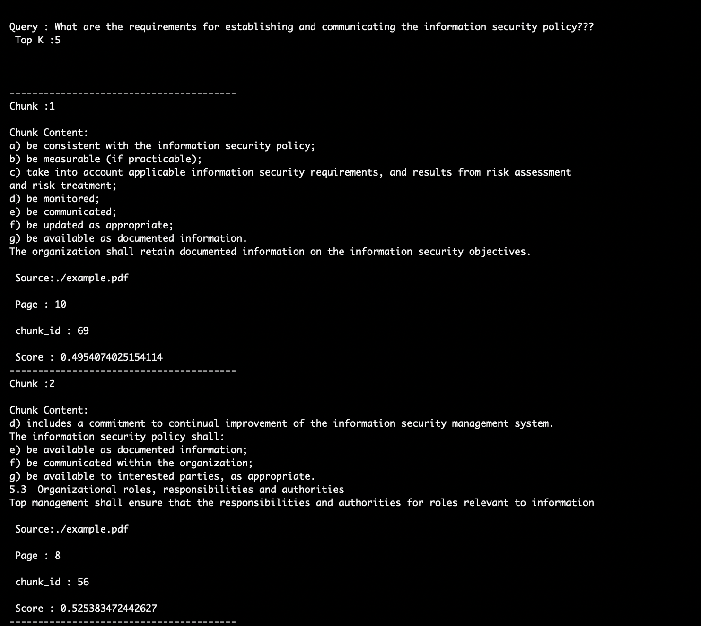
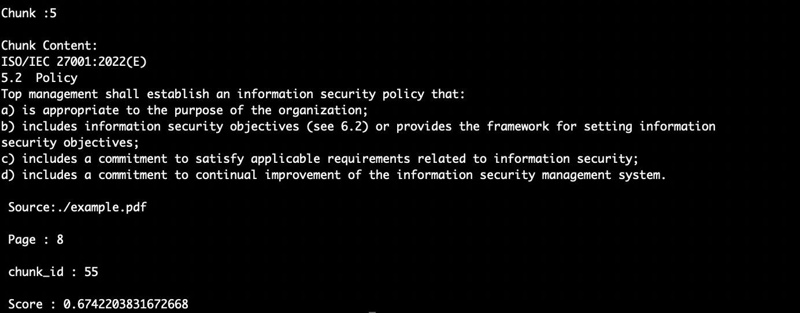
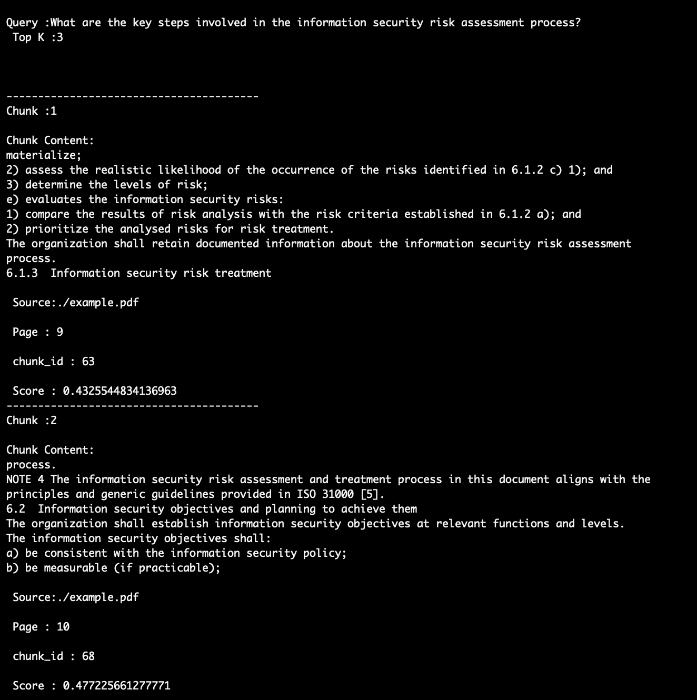
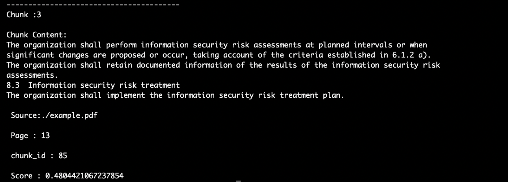

# Documentation For FAISS 

**This code will run in both Python3.11 and Python3.14**

**Steps to run the Code**

* pip install -r requirements.txt
* python3 rag_faiss.py

**Libraries Required**

```
from langchain_community.document_loaders import PyPDFLoader
from langchain_text_splitters import RecursiveCharacterTextSplitter
from langchain_huggingface import HuggingFaceEmbeddings
from langchain_community.vectorstores import FAISS
import re
import pprint
```

#### The Above Libraries were used in the code

* **langchain_community.document_loaders import PyPDFLoader** helps us toparse the PDF documents required for the context

* **langchain_text_splitters import RecursiveCharacterTextSplitter**. This will Help us to create Chunks from the parsed PDF document data

* **langchain_huggingface import HuggingFaceEmbeddings** helps us to use the **sentence-transformers/all-MiniLM-L6-v2** an Industry Standard to create the embedings

* **langchain_community.vectorstores import FAISS** helps us to get the FAISS(FAcebook AI Similarity Search) used to store the Embedings and perform Fast Similarity Search

## Loading the PDF

```
ilepath="./example.pdf"

loader=PyPDFLoader(filepath)
print(loader)

docs=loader.load()
```
 
 The Above code Demonstrates The loading of the PDF document using the Langchain Library PyPDFLoader

## Chunking the Document

```
text_splitter=RecursiveCharacterTextSplitter(chunk_size=500,chunk_overlap=100)

chunks=text_splitter.split_documents(docs)

for idx,chunk in enumerate(chunks):
  chunk.metadata["chunk_id"]=idx
```
From the Above code we use the RecursivecharacterTextSplitter for the chunking of the documents and each chunk has 500 characters as the information was largely in paragraph format and overlap of 100 to preserve the edge information

## Embeding of the Chunks

```
embedings=HuggingFaceEmbeddings(model_name="sentence-transformers/all-MiniLM-L6-v2")

faiss_db=FAISS.from_documents(
  documents=chunks,
  embedding=embedings
)

faiss_db.save_local("ragdata")
```
The Above code Snippets shows that we use the **sentence-transformers/all-MiniLM-L6-v2** transformer to create the embeding

faiss_db will create a vector database with document chunks and embeding model as input parameters and saved locally as ragdata 


## Query

```
query="How does top management demonstrate leadership and commitment to the ISMS?"
docs=faiss_db.similarity_search_with_score(query,k=5)
```
The Above Will Represents how we query the faiss database. We use the similarity_search_with_score which takes the raw query as input that will convert into embedings using the model we used for embeding while we confgure

## Outputs

### Sample Outputs

### Query 1: How does top management demonstrate leadership and commitment to the ISMS?
### TOP K=5




### Query 2: What are the requirements for establishing and communicating the information security policy?
### TOP K=5






### Query 2: What are the key steps involved in the information security risk assessment process?
### TOP K=3




